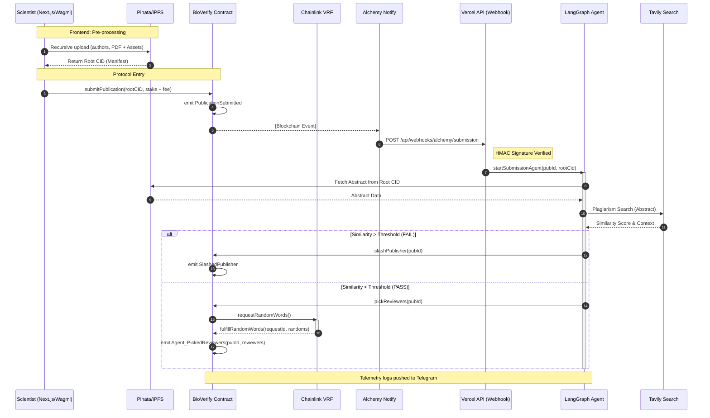

## 🛠 Protocol Roadmap & Status

> **Note:** This project is developed in parallel with a full-time professional software engineering role.

### ✅ Phase 1: Autonomous Foundation & Publication Submission
**Timeline:** Jan 27 — Feb 6, 2026

* **Protocol Engine (Solidity & Foundry)**
    * **[x] Incentive Alignment:** Implemented a game-theoretic staking model requiring collateral from both Scientists (Submission Stake) and Reviewers (Commitment Stake).
    * **[x] Sustainable Tokenomics:** Developed a **Decoupled Economic Model** separating returnable stakes from operational fees to cover Chainlink VRF costs.
    * **[x] Validation:** Achieved **100% Line Coverage** using the Foundry suite.
* **Agentic Forensic Layer (LangGraph.js)**
    * **[x] Stateful AI Reasoning:** Built a multi-stage graph orchestrating **IPFS/Pinata** for metadata ingestion and **Tavily Search** for literature overlap (publication abstract).
    * **[x] Autonomous Settlement:** Integrated a **Viem-based signer** allowing the AI agent to execute on-chain slashes or reviewer triggers based on forensic output.
* **Full-Stack Infrastructure & UX**
    * **[x] Scientist Submission Portal:** Developed a React-based frontend using **Wagmi** for seamless  IPFS metadata pinning and publication submission.
    * **[x] Event-Driven Architecture:** Established a secure **Alchemy Notify** pipeline with HMAC signature verification.
    * **[x] Real-time Monitoring:** Deployed a **Telegram Notification Engine** for live telemetry of protocol activity and AI reasoning logs.
 

---

### 🏗 Phase 2: Decentralized Reviewer Orchestration
**Timeline:** Feb 7, 2026 — Present

* **Reviewer Lifecycle & Persistence**
    * **[ ] Sync Engine:** Configure Alchemy Notify for `BioVerify_Agent_PickedReviewers` events to trigger off-chain coordination.
    * **[ ] Reviewer Memory (Supabase):** Implement a persistence layer to map VRF-selected addresses to assigned publications for dashboard querying.
* **Human-In-The-Loop (HITL) Review Pipeline**
    * **[ ] IPFS Review Schema:** Define standardized JSON schema for reviews (verdict, reason, and reviewer address).
    * **[ ] Reviewer Orchestrator:** Develop a LangGraph-based agent to manage the review collection.
* **On-Chain Finality**
    * **[ ] Review Submission Logic:** Implement `reviewPublication(uint256 pubId, bool validation, string reviewCID)` in the core contract.
    * **[ ] Consensus Engine:** Develop logic to aggregate reviewer verdicts to finalize publication status and distribute rewards.
